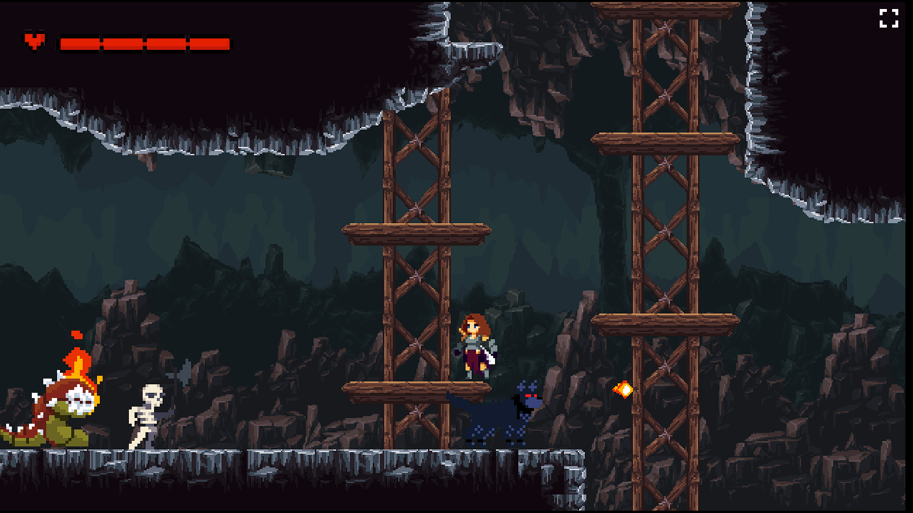
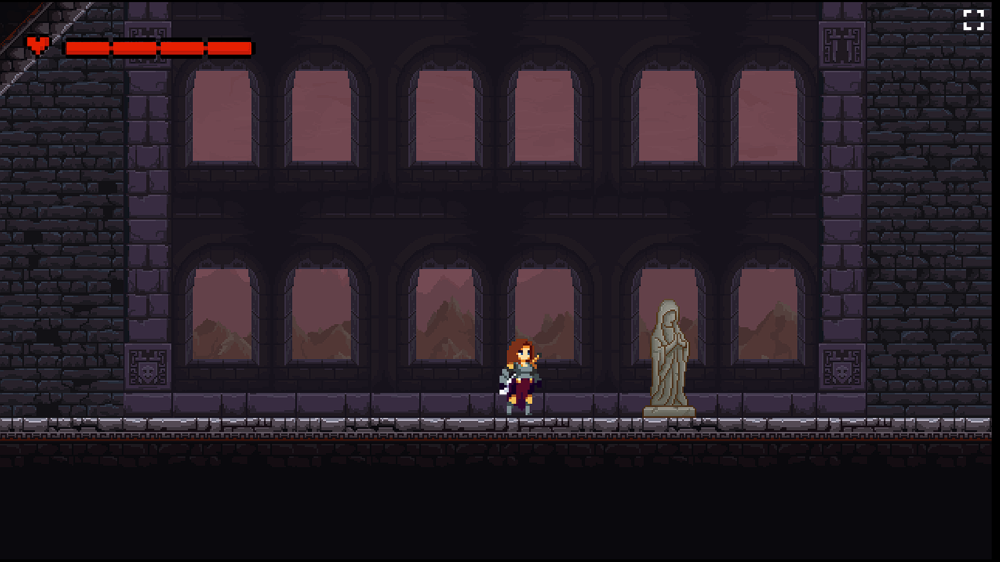

# GodSlayer  

Grupo 7: Grisucios.

Integrantes: Daniel Hernández Martínez , Pablo Imbert Fernández, Julián Moreno Bellaneda, Juan Coello Fernández. 

Juego: https://dahermar.github.io/GodSlayer.github.io/

<h2>GDD</h2>

<h3>Género:</h3>
Metroidvania y plataformas 2D

<h3>Plataforma:</h3>
Página Web

<h3>Pegi:</h3>
PEGI 7, debido a la inclusión de violencia no gráfica.

<h3>Descripción</h3>

Juego de plataformas y acción lateral en 2D para web. Vive una experiencia centrada en la exploración, combate y plataformeo en una aventura épica a través de un mundo medieval. Explora un mundo oscuro lleno de secretos y coleccionables y obtén habilidades únicas que te harán avanzar a nuevas partes del mapa. Experimenta un combate centrado en el uso de la espada y la movilidad del personaje. 

<h3>Historia:</h3>
Tras años de terror bajo la tiranía del dios Haldohr, su implacable ejército alcanza las tierras del norte. Destruyendo todo a su paso, las tropas arrasan con una oculta aldea en el bosque. Entre los restos se vislumbra una figura. La diosa Axelia observa a la joven junto a los cuerpos inertes de sus padres. Conmovida por su dolor, le ofrece su guía en la misión de devolver la paz a su reino.

<h3>Contexto Cultural:</h3>
Ha habido muchos aspectos de la cultura del videojuego que nos ha influenciado a la hora de desarrollar nuestro proyecto. Juegos como Hollow Knight u Ori and the Blind Forest han sido nuestra inspiración a la hora de establecer la jugabilidad. Una de las sagas que más nos han influenciado a los integrantes del grupo ha sido el Dark Souls. De esta saga hemos sacado dos aspectos importantes. El primero es el ritmo pausado a la hora de atacar. Esto obliga al jugador a elegir correctamente el momento de efectuar un ataque, ya que si lo hace precipitadamente puede ser fácilmente castigado por el enemigo. La segunda es la ambientación y lore, lo cual se ve reflejado en el videojuego. 

<h3>Mecánicas:</h3>

<h4>Ataque</h4>

Ataque con espada y lanzar daga.

<h4>Movimiento</h4>

Dash, Doble salto y rebotar en la pared.

<h4>Otros</h4>

Revivir en las estatuas, obtener poderes después de superar cada boss, recoger coleccionables, usar una poción para curarse, los pinchos matan instantáneamente.

<h4>Mecánicas de los jefes:</h4>

El primer jefe es invulnerable y corre hacia el jugador.
El segundo jefe tiene 4 vidas pero se hace invulnerable durante 2 segundos una vez es atacado. Tiene 2 tipos de ataques entre los que alterna que se realizan de forma aleatoria y son una bola grande o 3 pequeñas.
El tercer jefe tiene 4 vidas y una vez es atacado se teletransporta a otro lugar. Con más de la mitad de la vida realiza 2 tipos de ataques, uno simple y otro fuerte que ocurre cada menos tiempo. Cuando tiene la mitad de la vida o menos cambia su ataque simple por 3 individuales en la dirección a la que se mueve el jugador. Los esqueletos muertos de la zona de este jefe son revividos por este cuando pasas cerca de su zona.

<h3>Dinámicas:</h3>

Usar doble salto con el dash para llegar más lejos.
Usar el dash para esquivar ataques enemigos.
Usar el doble salto para esquivar habilidades enemigas.
Atacar en el aire a enemigos que vuelan.
Usar los rebotes en la pared para recuperar el doble salto y mantenerse en el aire.
Los jugadores deberán evitar usar las pociones si están con toda la vida puesto que las perderán al cogerlas.
Aprenderse los ataques de los bosses para crear estrategias.
Aprenderse el “timming” de los arqueros y gusanos para esquivar sus proyectiles en el plataformeo.

<h3>Controles</h3>

|              |Teclado              |
|--------------|---------------------|             
|Movimiento    | WASD                |
|Salto         | W                   |
|Ataque básico | J                   | 
|Lanzable      | L                   | 
|Dash          | Shift               |

<h3>Resumen de dirección artística</h3>

Es un mundo oscuro y apagado, ya que se quiere representar un mundo devastado por Haldohr. A su vez, la historia está centrada en la venganza y la tristeza de la protagonista y estos colores lo representan.
Al tener temática medieval y fantástica, los sprites están relacionados con elementos típicos como: armaduras, armas a melee, magos, esqueletos, criaturas fantásticas, animales hostiles de bosques y cuevas, etc...
Los sprites de los enemigos están relacionados con el bioma en el que se encuentran, así en el bosque podremos encontrar lobos por ejemplo y en la cueva murciélagos.

<h3>Paleta de colores</h3>

<h3>Diagramas UML</h3>

<h3>Pruebas con usuarios</h3>

Hemos realizado pruebas del videojuego con una gran cantidad usuarios. Todos nos dieron feedback, pero expondremos las opiniones de cuatro usuarios, ya que las del resto coinciden con las suyas.

Usuario 1: Jugador habitual de videojuegos sin mucha experiencia en juegos de plataformas y metroidvanias. Al ser el primer usuario que probó el juego, lo encontró en un estado menos balanceado y pulido. Debido a ello, nos fue muy útil para balancear los niveles.

- Encontró difícil y frustrante algunas zonas de plataformeo.

    Solución: Ajustamos ciertas zonas de plataformas para reducir su dificultad
- No le gustó el mensaje de muerte.

    Solución: Teníamos un debate interno sobre si quitarlo o dejarlo. Al ver que a personas ajenas tampoco les gustaba, decidimos quitarlo.
- Le costó pasarse una zona que no tenía un punto de control cerca. Encontró frustrante que si se moría más adelante tenía que volver a pasársela. Esto mismo le ocurrió a algún usuario más.

    Solución: Decidimos añadir un punto de control en un camino paralelo al principal. De esta forma si el usuario decide explorar los caminos encontrará el punto. Así     conseguimos reducir la frustración del jugador y, a su vez, recompensar la exploración.
- Debido a la gran cantidad de enemigos en algunas zonas, el usuario optó por pasarse ciertas zonas ignorándolos.

    Solución: Redujimos la cantidad de enemigos en ciertas zonas con una alta densidad de ellos.
- Pese a encontrar el juego difícil en general, se pasó el boss final de manera muy sencilla. Esto se debió a que si te movías muy rápido por el escenario era muy sencillo esquivar sus ataques.

    Solución: Ajustamos la dificultad del boss final, incrementando su velocidad de ataque y dividiendo el combate en dos fases. La primera fase tiene los mismos           ataques, pero añadimos uno nuevo más difícil de esquivar en la segunda.

Usuario 2: Jugador habitual de videojuegos sin ninguna experiencia con juegos de plataformas.
 
 - Murió muchas veces y nos dimos cuenta que el juego lageaba cada vez más con cada muerte del jugador. 

    Solución: Buscamos posibles causas del lageo. Nos centramos en el reseteo del mapa al morir y nos dimos cuenta de que al morir las pociones no se eliminaban, por lo que al reaparecer se generaba otra poción encima de las existentes, lo que generaba el lag.
- Por otra parte, debido a que fue el primer usuario probando el segundo bioma,  vimos que la dificultad de determinadas zonas era excesiva. 

    Solución: En aquellas zonas en las que el jugador se quedaba atascado miramos si había alguna forma de reducir un poco la dificultad. Esto es o reducir el número de enemigos de la zona o hacer el tema de plataformeo más fácil (Por ejemplo en alguna zona subiendo un poco el techo para hacer el salto más fácil).
- Por último descubrimos un bug con el cúal podía pasarse el segundo boss sin matarlo.
    
    Solución: Modificamos el código del boss para que no se pudiera usar este bug. Para ello creamos una hitbox extra en el cuerpo del boss y le pusimos colisión con el jugador evitando así el error.
- Descubrió que había un salto que no se podía realizar y te impedía volver atrás en el endgame.
    
    Solución: Ajustamos una plataforma para permitir el salto.

Usuario 3: Experiencia baja en este género. Fue el primer usuario en pasarse el juego completo pasando por todos los caminos opcionales.

- Nos dio feedback de algunas zonas que nadie había probado.
    
    Solución: Realizamos un ajuste a ciertas zonas.

Usuario 4: Estudiante de la carrera de desarrollo de videojuegos y jugador habitual. Debido a su experiencia desarrollando videojuegos, nos dio algún consejo útil.

- Nos hizo ver que la primera vez que presentamos a los murciélagos, aparecían una cantidad demasiado elevada de ellos. Esto resultaba frustrante ya que todavía no conoces sus mecánicas y te puedes sentir abrumado. Además nos dijo que algunos enemigos más no estaban correctamente presentados, ya que los introducimos en sitios muy complicados en los que aprender sus mecánicas se hace realmente difícil

    Solución: Redujimos el número de murciélagos la primera vez que te los encuentras.
- Nos dijo que los murciélagos quitaban demasiada vida.
    
    Solución: En el grupo había división de opiniones sobre si bajar la dificultad, ya que de dos ataques te mataban. Como más gente opinaba que quitaban demasiado, les bajamos el daño.
- Al igual que otros usuarios, encontró alguna zona con demasiados enemigos.

    Solución: Redujimos el número de enemigos en algunas secciones.

- Como valoración personal recalcó que los pinchos suelen quitar toda la vida del personaje, aunque fue más un gusto propio por lo que no lo tuvimos demasiado en  cuenta.

