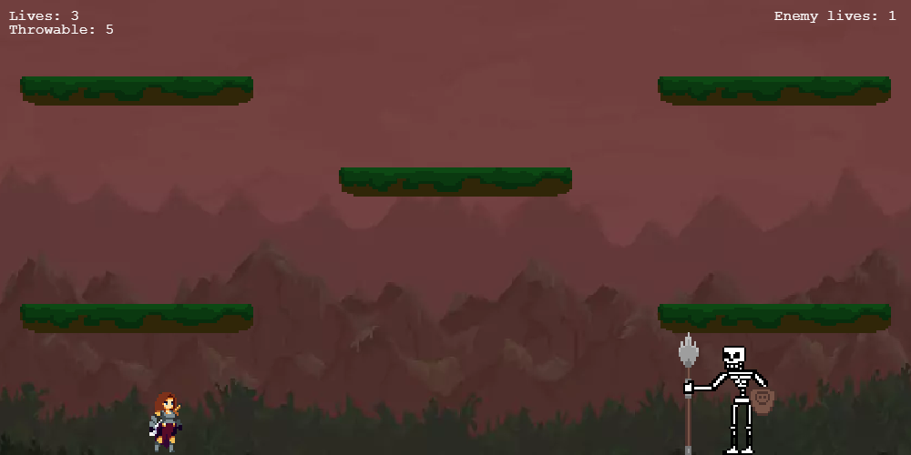

# GodSlayer  

Grupo 7

<h2>GDD</h2>

<h3>Datos generales</h3>

Género: Metroidvania
Temática: Fantasía, Medieval
Plataforma: Página Web

<h3>Descripción</h3>

Juego de plataformas y acción lateral en 2D para web, principalmente centrado en ordenador. El juego se enfoca a exploración, combate y plataformeo en una aventura épica a través de un mundo medieval. Explora un mundo oscuro lleno de secretos, coleccionables y obtén habilidades únicas que te harán avanzar a nuevas partes del mapa. El combate utiliza varios tipos de armas, pero en un principio está centrado en la espada, con la que se puede golpear a los enemigos en 2 direcciones (izquierda y derecha). 

<h3>Historia</h3>
Nuestra protagonista sin nombre ha sido una don nadie toda su vida. Tras vivir en un mundo dominado por dioses corruptos, obtiene la oportunidad de revelarse ante ellos al recibir el poder de un dios. Así comienza un viaje de venganza y muerte con el fin de acabar con su tiranía.
<h3>Mecánicas</h3>Dash, Doble salto, Lanzar un objeto, Ataque.

<h3>Controles</h3>

|              |Teclado              |
|--------------|---------------------|             
|Movimiento    | WASD                |
|Salto         | W| 
|Ataque básico | J                   | 
|Ataque fuerte | K                   |
|Lanzable      | L                   | 
|Dash          | Shift               |

<h3>Resumen de dirección artística</h3>

Es un mundo oscuro y apagado, ya que se quiere representar un mundo lúgubre y decaído.

Al tener temática medieval y fantástica, los sprites están relacionados con elementos típicos como: armaduras, armas a melee, magos, esqueletos, etc...

<h3>Paleta de colores</h3>

