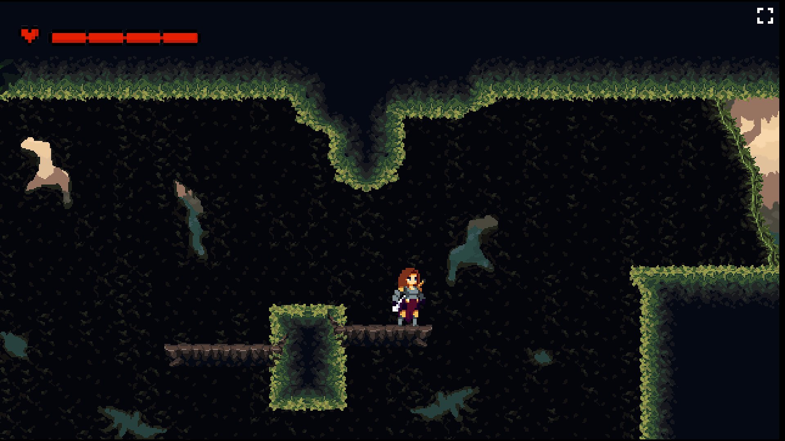
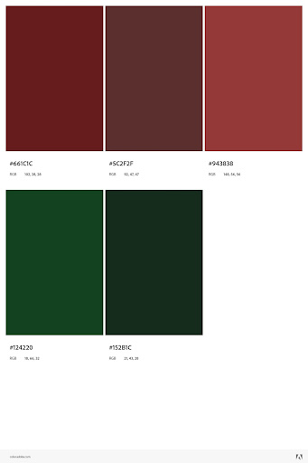

# GodSlayer  

Grupo 7 : Grisucios.

Juego: https://dahermar.github.io/GodSlayer.github.io/

<h2>GDD</h2>

<h3>Datos generales</h3>

Género: Metroidvania
Temática: Fantasía, Medieval
Plataforma: Página Web

<h3>Descripción</h3>

Juego de plataformas y acción lateral en 2D para web, principalmente centrado en ordenador. El juego se enfoca a exploración, combate y plataformeo en una aventura épica a través de un mundo medieval. Explora un mundo oscuro lleno de secretos, coleccionables y obtén habilidades únicas que te harán avanzar a nuevas partes del mapa. El combate utiliza varios tipos de armas, pero en un principio está centrado en la espada, con la que se puede golpear a los enemigos en 2 direcciones (izquierda y derecha). 

<h3>Historia</h3>
Nuestra protagonista sin nombre ha sido una don nadie toda su vida. Tras la destrucción de su pueblo a manos del dios oscuro Haldohr dando muerte a sus padres la protagonista destrozada llama la atención de una diosa benevolente llamada Axelia. Esta decide ayudarla para acabar con la tiranía de Haldohr. Así nuestra protagonista se adentra en un viaje para cumplir su venganza.

<h3>Mecánicas</h3>Dash, Doble salto, Lanzar un objeto, Ataque, Rebote en la pared.

<h3>Controles</h3>

|              |Teclado              |
|--------------|---------------------|             
|Movimiento    | WASD                |
|Salto         | W                   |
|Ataque básico | J                   | 
|Lanzable      | L                   | 
|Dash          | Shift               |

<h3>Resumen de dirección artística</h3>

Es un mundo oscuro y apagado, ya que se quiere representar un mundo devastado por Haldohr, a su vez la historia está centrada en la venganza y la tristeza de la protagonista.

Al tener temática medieval y fantástica, los sprites están relacionados con elementos típicos como: armaduras, armas a melee, magos, esqueletos, etc...

Los sprites de los enemigos están relacionados al bioma en el que se encuentran, asi en el bosque podremos encontar lobos por ejemplo y en la cueva murciélagos.

<h3>Paleta de colores</h3>

